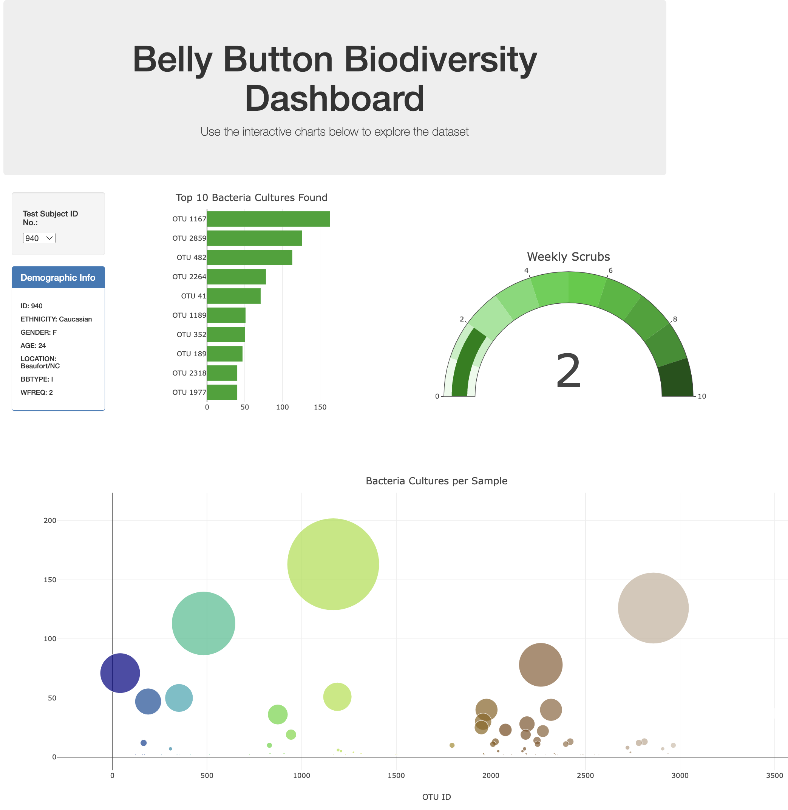

# belly-button-challenge
In this project we used javascript to analyze the data on Belly Button Biodiversity. I built an interactive dashboard to explore the Belly Button Biodiversity datasetLinks to an external site., which catalogs the microbes that colonize human navels.

The dataset reveals that a small handful of microbial species (also called operational taxonomic units, or OTUs, in the study) were present in more than 70% of people, while the rest were relatively rare.

### Preview of Dashboard:

## Go to following page to visualize Dashboard:
https://minmincg.github.io/belly-button-challenge/

# References
Hulcr, J. et al. (2012) A Jungle in There: Bacteria in Belly Buttons are Highly Diverse, but Predictable. Retrieved from: http://robdunnlab.com/projects/belly-button-biodiversity/results-and-data/Links to an external site.

Analysis and interactive dashboard was made by only one author, me. 